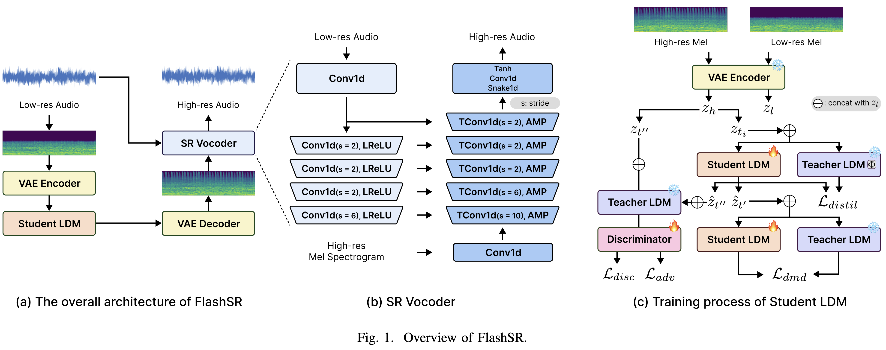

# FlashSR: One-step Versatile Audio Super-resolution via Diffusion Distillation
[](https://arxiv.org/abs/2501.10807) [](https://jakeoneijk.github.io/flashsr-demo/)



This is a PyTorch implementation of FlashSR.

If you find this repository helpful, please consider citing it.
```bibtex
@article{im2025flashsr,
  title={FlashSR: One-step Versatile Audio Super-resolution via Diffusion Distillation},
  author={Im, Jaekwon and Nam, Juhan},
  journal={arXiv preprint arXiv:2501.10807},
  year={2025}
}
```
## Set up
### Clone the repository.
```
git clone git@github.com:jakeoneijk/FlashSR_Inference.git
```
```
cd FlashSR_Inference
```

### Make conda env (If you don't want to use conda env, you may skip this)
```
source ./Script/0_conda_env_setup.sh
```

### Install pytorch. You should check your CUDA Version and install compatible version.
```
source ./Script/1_pytorch_install.sh
```

### Setup this repository
```
source ./Script/2_setup.sh
```

### Download pretrained weights. 

[](https://huggingface.co/datasets/jakeoneijk/FlashSR_weights/tree/main)

## Use
### Please check Example.py

After installation, you can import the module from anywhere
```python
from FlashSR.FlashSR import FlashSR

student_ldm_ckpt_path:str = './ModelWeights/student_ldm.pth'
sr_vocoder_ckpt_path:str = './ModelWeights/sr_vocoder.pth'
vae_ckpt_path:str = './ModelWeights/vae.pth'
flashsr = FlashSR( student_ldm_ckpt_path, sr_vocoder_ckpt_path, vae_ckpt_path)
```

Read the low-resolution audio
```python
audio_path:str = './Assets/ExampleInput/music.wav'

# resample audio to 48kHz
# audio.shape = [channel_size, time] ex) [2, 245760]
audio, sr = UtilAudio.read(audio_path, sample_rate = 48000)

# currently, the model only supports 245760 samples (5.12 seconds of audio)
audio = UtilData.fix_length(audio, 245760)
audio = audio.to(device)
```

Restore high-frequency components by FlashSR
```python
# lowpass_input: if True, apply lowpass filter to input audio before super resolution. This can help reduce discrepancy between training data and inference data.
pred_hr_audio = flashsr(audio, lowpass_input = False)
UtilAudio.write('./output.wav', pred_hr_audio, 48000)
```


## References
- [AudioSR](https://github.com/haoheliu/versatile_audio_super_resolution)
- [BigVGAN](https://github.com/NVIDIA/BigVGAN)
